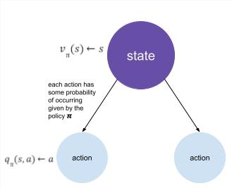

## Bellman Equation 

Let's take a closer look at the value function that we discussed last time. We will decompose it so that we can see a recursive structure.
$$\begin{align}
v_\pi(s) &= E_\pi[G_t | S_t = s] \\ 
&= E_\pi[R_{t+1} + \gamma R_{t+2} + \gamma^2 R_{t+3} + \cdots | S_t = s] \\
&= E_\pi[R_{t+1} + \gamma (R_{t+2} + \gamma R_{t+3} + \cdots) | S_t = s] \\
&= E_\pi[R_{t+1} + \gamma G_{t+1} | S_t = s] \\
&= E_\pi[R_{t+1} + \gamma v_\pi(S_{t+1}) | S_t = s] \\
\end{align}$$

Similarly, we can do the same for the Q-function:
$$q_\pi(s, a) = E_\pi[R_{t+1} + \gamma q_\pi(S_{t+1}, A_{t+1}) | S_t = s, A_t = a]$$

Now, when we consider the value function, what it is really doing is it's looking ahead from its current state and performing a weighted sum of all the all the possible actions from that state to the next one. For each of those actions that we can take, there is a Q-value associated with it. Mathematically, we can express this as: 
$$v_\pi(s) = \sum_{a \in A} \pi(a|s) q_\pi(s, a)$$

> 

  💡 Pictorial representation of the relationship between $q$ and $v$ (click me)  

 

Now, to find the converse relationship, we now consider that we're in a given state, and we are wondering how good it is to take a specific action. For this action, we will get an immediate reward and will then end up in a specific state as given by the state transition matrix. We now can use the value function to find the expected return from this new state. Mathematically, we can express this as:
$$ q_\pi(s, a) = \mathcal{R}_s^a + \gamma \sum_{s' \in S} \mathcal{P}_{ss'}^a v_\pi(s') $$

Combining the two representations above, we find a recurrence relation for the value function and Q-function as follows:

$$ v_\pi(s) = \sum_{a\in A} \pi(a|s) = ( \mathcal{R}_s^a + \gamma \sum_{s' \in S} \mathcal{P}_{ss'}^a v_\pi(s') ) $$

$$ q_\pi(s,a) = \mathcal{R}_s^a + \gamma \sum_{s' \in S} \mathcal{P}_{ss'}^a \sum_{a' \in A} \pi(a'|s') q_\pi(s', a') $$

---
*Adapted from UC Berkeley's CS 188: Introduction to Artificial Intelligence, Spring 2022 [Note 8](https://inst.eecs.berkeley.edu/~cs188/sp22/assets/notes/n8_sp22.pdf) and David Silver's [Markov Decision Processes](https://www.davidsilver.uk/wp-content/uploads/2020/03/MDP.pdf)*